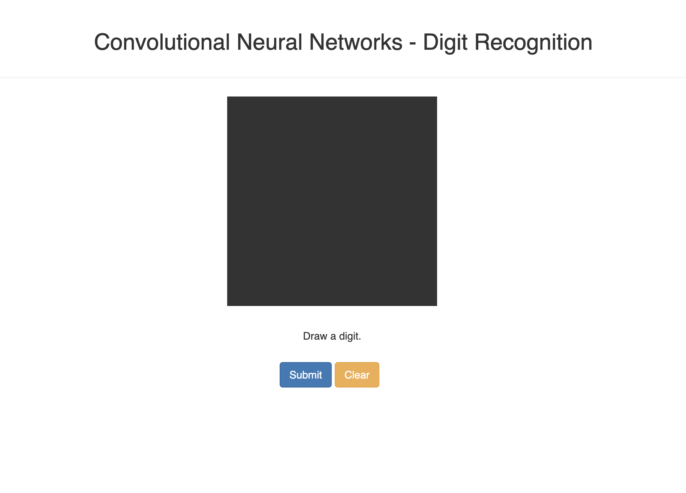

# MNIST

Convolutional Neural Networks - Digit Recognition

A write pad that recognize numeric single digit. 

## Installation

Build docker/podman image

```bash

podman build . -t mnist

# or

docker build . -t mnist

```

## Usage

```bash

podman run -p 8080:8080 -d mnist

# or

docker run -p 8080:8080 -d mnist

# Then go to localhost:8080 on browser

```

## UI





## Contributing

Pull requests are welcome. For major changes, please open an issue first
to discuss what you would like to change.

Please make sure to update tests as appropriate.

## License

[MIT](https://choosealicense.com/licenses/mit/)
